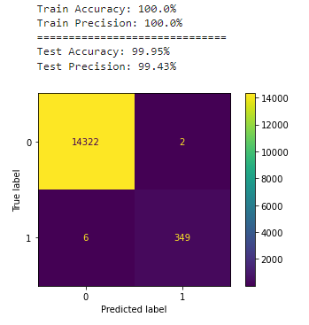
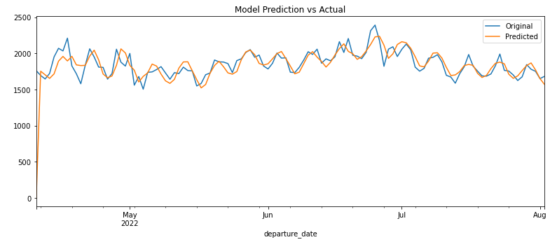
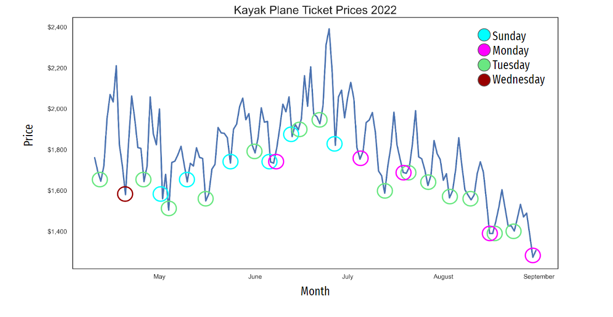

# Kayak Plane Ticket Price Analysis

Author: Jun (Andrew) Choi

---

## Table of Contents

1. Business Understanding
2. Data
3. EDA and Data Cleaning
4. Modeling
5. Evaluation
6. Appendix

---

## 1. Business Understanding

In the era of covid where travel was few and far between many of us have been unable to travel.  

However, looking optimistically into the future as covid **hopefully** becomes a thing of the past traveling will once again become a part of our lives.  

With this in mind I sought to find when it would be the best time to purchase a ticket overseas or if there would be any specific features that could predict the prices of tickets over time.

---

## 2. Data

All of the data used in this analysis was gathered from [Kayak](https://www.kayak.com/flights) using a scraper from **Fabio Neves** [Github](https://github.com/fnneves/flight_scraper/blob/master/FlightScraper%20python%20bot%20for%20kayak.ipynb) [Medium](https://medium.com/@fneves/if-you-like-to-travel-let-python-help-you-scrape-the-best-fares-5a1f26213086)  

The code for the scraper was from 2019 so it did not work and required some modifications to properly scrape from Kayak.  

You can find the updated scrapers for both Windows and Mac OS in [py_files](https://github.com/cjunhyuk/plane_price_proj/tree/master/py_files).

### Limitations

- Data was gathered from only Kayak
- Data collection was conducted from 2022-Apr-3 to 2022-Apr-10
- Plane Tickets were restricted to only round trip tickets
- All departure and return dates were spaced 1 week apart
- Flights were gathered for a period of 4 months beginning at 2022-Apr-10 to 2022-Sep-1
- From the following locations
    1. New Jersey (EWR)
    2. New York (All Airports)
    3. California (SAN)
- To the following destinations
    1. Singapore
    2. South Korea
    3. Phuket, Thailand

---

## 3. EDA and Data Cleaning

After removing any possible duplicate entries I was left with 58,713 unique tickets.  

When assigning the targets to the data set the criterias I chose were:

1. If the ticket price was in the bottom 25% of its respective dataset
2. If the ticket overall duration was in the bottom 25% of its respective data set

Essentially what I wanted were the shortest and cheapest flights.  

Because of the class imbalance that was present it was essential to utilize [SMOTE](https://imbalanced-learn.org/stable/references/generated/imblearn.over_sampling.SMOTE.html).  

To compile the master dataset I created a [compiler function](https://github.com/cjunhyuk/plane_price_proj/blob/master/py_files/cleaner.py) that combined all of the tickets from the specific routes.  

This was also where the target assigning and most of the feature enginering took place.

---

## 4. Modeling

The evaluation metric I decided to use was Accuracy and Precision.  

The reason I chose **precision** is because I wanted more emphasis on identifying false postives so my model would not return a ticket that was not the cheapest and shortest duration.  

For the baseline model I chose to utilize a Dummy Classifier that produced an accuracy score of 50.63%.  

When running my first Logistic Regression Model it produced an accuracy score of 99.03% and precision score of 83.39%.  

Comparing this to the final model I decided to use which was a Decision Tree Classifier we can see a drastic improvement in model performance.  

This result was achieved using the optimal parameters found through the use of Grid Search.  

I also use Time Series modeling to evaluate how effectively I could predict the price change over time.  

The model performed quite well, however it can definitely still improved with the addition of more data.  

---

## 5. Evaluation

From the analysis I conducted I found that:

1. Tuesday was the best day for departure flights consisting of 22% of the cheapest and shortest flights
2. The best departure times were from either 5:00 AM to 8:00 AM **OR** after 6:00 PM
3. When you searched the ticket price did not really affect the price, however **once it was approximately 4 months away the prices showed a steady decline**.
   1. This may be because of the time frame or it could be because it is after the summer season. Additional analysis would need to be conducted to come to any concrete answers.

---

## 6. Appendix

[Github](https://github.com/fnneves/flight_scraper/blob/master/FlightScraper%20python%20bot%20for%20kayak.ipynb) [Medium](https://medium.com/@fneves/if-you-like-to-travel-let-python-help-you-scrape-the-best-fares-5a1f26213086) base code for scraper used by **Fabio Neves**  
[Data Dictionary](data/Data%20Dictionary.xlsx) for master data set  
[Kayak](https://www.kayak.com/flights) Website used for data collection  
[Line Plot](/images/Price%20Lineplot.png) used for presentations

---
